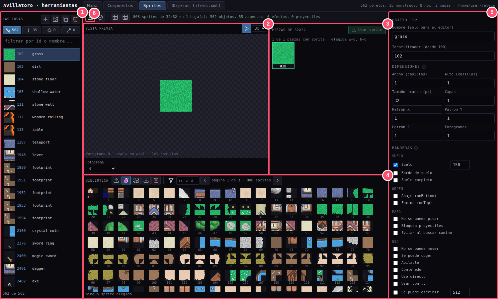
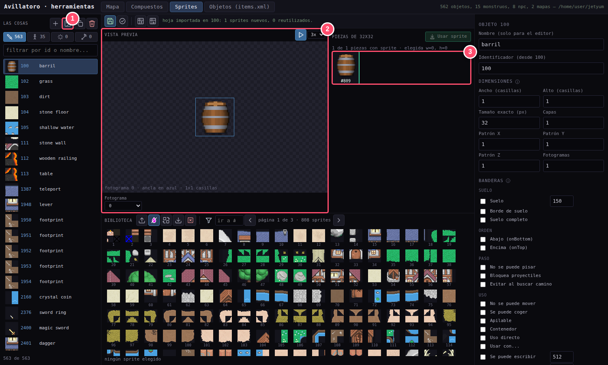
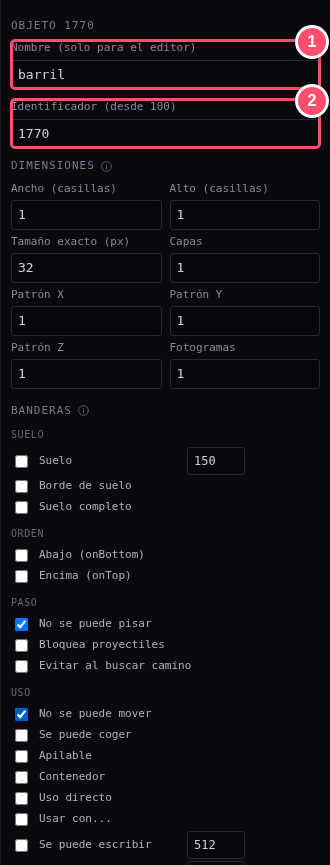
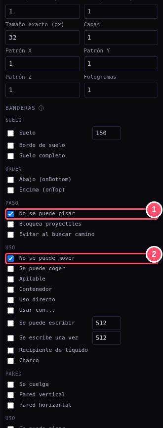
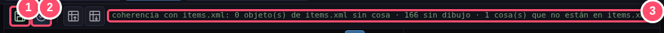

# 🎨 Guía 1 · Dibujar: la pestaña Sprites

> **Lo que vas a conseguir:** que tu dibujo exista dentro del juego, con su número y sus
> características.
> **Tiempo:** unos 5 minutos · **Necesitas:** el editor abierto (`npm run editor`) y una imagen
> PNG.

[← Volver al índice](README.md) · [Siguiente: Dar de alta →](02-objetos.md)

---

## Un vistazo a la pestaña

Abre el editor y pulsa la pestaña **Sprites**, arriba. Es el taller donde se guardan todos los
dibujos del juego.

| | Zona | Para qué sirve |
|:-:|---|---|
| **1** | **Las cosas** | La lista de todo lo que se puede dibujar. Arriba, sus botones (nueva, nueva desde imagen, duplicar y borrar) y cuatro iconos para las categorías: *Objetos* (la espada), *Aspectos* (el muñeco, personajes y monstruos), *Efectos* (el destello) y *Proyectiles* (la flecha). Debajo, un buscador. |
| **2** | **Vista previa** | El dibujo elegido, en grande y animado si tiene animación. |
| **3** | **Piezas de 32×32** | Los cuadraditos que forman el dibujo. Un objeto grande tiene varios. |
| **4** | **Biblioteca de sprites** | Todos los cuadraditos que existen, numerados. Es el «almacén» del que salen los dibujos. |
| **5** | **Propiedades** | El nombre, el número, el tamaño y las características del objeto elegido. |
| **6** | **Guardar** | El disquete verde. Escribe los cambios: hasta que no lo pulses, nada es definitivo. Se ilumina cuando hay cambios sin guardar. |

> [!TIP]
> **Casi todos los botones son iconos.** Deja el ratón quieto encima de uno y te dice qué hace.
> Los títulos con una **ⓘ** también tienen su explicación en el globo.

---

## Paso 1 · Crear el objeto a partir de tu imagen

Pulsa **«Nueva desde imagen»** (1, el icono de la imagen con un +) y elige tu PNG. En el ejemplo es
[`barril.png`](ejemplo/barril.png).

El editor hace tres cosas a la vez:

- Corta la imagen en cuadraditos de 32×32 y los guarda en la biblioteca.
- Crea un objeto nuevo con el **nombre del archivo** («barril») y le pone un número provisional.
- Lo enseña en la **vista previa** (2) y en sus **piezas** (3).

> [!TIP]
> **¿Tu imagen es más grande que 32×32?** No pasa nada: una imagen de 64×64 se convierte
> sola en un objeto de 2×2 casillas. Los objetos grandes se apoyan en su casilla de **abajo a la
> derecha** y crecen hacia arriba y hacia la izquierda, igual que en Tibia.

---

## Paso 2 · Ponerle nombre y número

En **Propiedades**, a la derecha, revisa dos campos:

1. **Nombre.** Es solo para ti, para encontrarlo en la lista. Por ejemplo, «barril».
2. **Identificador.** Es **el número del objeto**, y tiene que ser el mismo que le darás en la
   pestaña Objetos. En el ejemplo, **1770**.

> [!IMPORTANT]
> **Apunta el número.** Lo vas a necesitar en la guía siguiente. Para elegir uno, una buena
> costumbre es usar el número que tiene ese objeto en Tibia, si existe. Si no, usa uno libre de la
> zona de su familia: del 100 al 999 terreno y muros, del 1000 al 1999 decoración y del 2000 al
> 2999 equipo. El editor no te deja usar un número que ya esté ocupado.

---

## Paso 3 · Decir cómo es

Más abajo están las **banderas**: casillas que se marcan para decir cómo se comporta el
objeto. Para un barril marcamos dos:

1. **No se puede pisar.** Los personajes no pueden atravesarlo.
2. **No se puede mover.** No se puede arrastrar con el ratón.

Las más usadas:

| Bandera | Márcala si… |
|---|---|
| **Suelo** | Es un suelo (hierba, piedra, agua). Va siempre debajo de todo. |
| **No se puede pisar** | Es un obstáculo: muros, árboles, barriles, mesas… |
| **Encima** | Debe taparse por encima de los personajes, como el marco de una puerta. |
| **Se puede coger** | Se puede guardar en la mochila. |
| **Apilable** | Se juntan varios en uno, como las monedas. |
| **Luz** | Debe dar luz: eliges el radio y el color. (Se guarda ya, aunque el juego todavía no dibuja las luces.) |
| **Elevación** | Lo que se ponga encima se dibuja más alto (mesas, cajas). |

> [!NOTE]
> Pasa el ratón por encima de cualquier bandera para ver una explicación.

---

## Paso 4 · Guardar y comprobar

1. Pulsa **Guardar** (1, el disquete, o **Ctrl+S**). Deja de estar iluminado cuando está todo
   guardado.
2. Pulsa **Comprobar coherencia** (2, el icono ✓).
3. Lee el mensaje (3). Ahora mismo dirá que hay **«1 cosa que no está en items.xml»**: es
   nuestro barril, que todavía no se ha dado de alta en el servidor. Es lo que haremos en la
   guía siguiente.

---

## Otras cosas que puedes hacer aquí

| Quiero… | Cómo |
|---|---|
| **Cambiar el dibujo de un objeto que ya existe** | Elige el objeto, pincha una de sus **piezas**, elige un sprite de la **biblioteca** y pulsa **«Usar #…»** (arriba de las piezas). También vale un **doble clic** en el sprite, o arrastrarlo encima de la pieza. Un clic normal en la biblioteca **solo elige**: no cambia nada, así no se reemplaza un dibujo sin querer. |
| **Subir muchos dibujos de golpe** | **Importar PNG** (la flecha hacia arriba) en la biblioteca: una hoja de cualquier tamaño (múltiplo de 32) se corta en cuadraditos y se añaden todos. Los repetidos y los vacíos se ignoran. Si la hoja tiene **fondo magenta** (rosa chillón), deja encendido el icono de la **gota magenta** y el fondo desaparece. |
| **Hacer una animación** | Pon más de 1 en **Fotogramas** e importa una imagen con un fotograma por columna con **Importar hoja de la cosa** (el icono de la cuadrícula con la flecha hacia arriba, arriba). |
| **Un personaje con cuatro direcciones** | En *Aspectos*, la **Dirección** (norte, este, sur, oeste) es el *Patrón X*. |
| **Copiar un objeto para hacer una variante** | **Duplicar** (los dos cuadrados): comparte los dibujos, sin copiar nada de más. |

---

[← Volver al índice](README.md) · [Siguiente: Dar de alta →](02-objetos.md)
