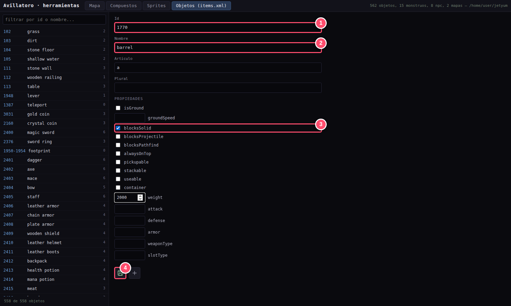
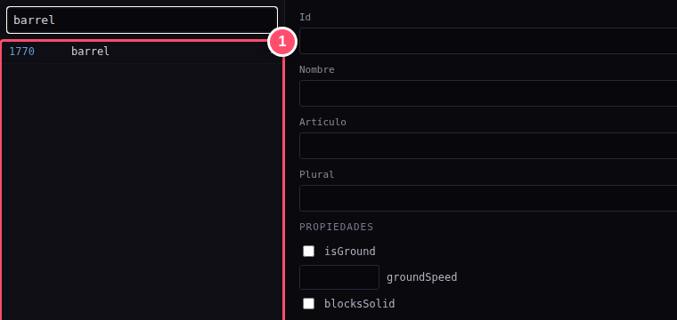
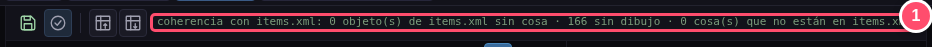

# 📋 Guía 2 · Dar de alta: la pestaña Objetos

> **Lo que vas a conseguir:** que el servidor del juego conozca tu objeto: cómo se llama, cuánto
> pesa y qué reglas cumple.
> **Tiempo:** unos 3 minutos · **Necesitas:** el número que elegiste en la guía 1 (en el ejemplo,
> **1770**).

[← Anterior: Dibujar](01-sprites.md) · [Índice](README.md) · [Siguiente: Colocar →](03-mapa.md)

---

## ¿Por qué otra vez?

En la guía 1 dibujaste **cómo se ve** el barril. Eso lo usa la pantalla de cada jugador.

Pero quien decide de verdad lo que pasa en el juego es el **servidor**: si puedes pasar a través
del barril, cuánto pesa, cómo se llama al mirarlo… El servidor no mira dibujos. Tiene su propia
ficha de cada objeto, y eso es lo que vas a rellenar ahora.

> [!NOTE]
> Es igual que en Tibia: el `Tibia.dat` del jugador dice cómo se ve cada objeto, y el `items.xml`
> del servidor dice cómo se comporta. Aquí los dos se editan desde el mismo programa.

---

## Paso 1 · Rellenar la ficha

Abre la pestaña **Objetos (items.xml)** y pulsa **Nuevo** (el **+**, abajo del formulario).

| | Campo | Qué poner |
|:-:|---|---|
| **1** | **Id** | El **mismo número** que en Sprites: **1770**. |
| **2** | **Nombre** | Cómo se llama dentro del juego: es lo que lee un jugador al mirarlo. |
| — | **Artículo** | `a` o `an` (*a barrel*, *an apple*). Puede quedar vacío. |
| **3** | **Propiedades** | Las reglas. Para el barril, **blocksSolid** (no se puede atravesar). En el ejemplo también se puso un peso (**weight**) de 2000, que son 20 onzas. |
| **4** | **Crear objeto** | El disquete verde: guarda la ficha. |

---

## Paso 2 · Que las dos fichas digan lo mismo

Las reglas de esta pestaña tienen que coincidir con las banderas que marcaste en Sprites. Esta
es la correspondencia:

| En **Sprites** marcaste… | …aquí marcas | Significa |
|---|---|---|
| Suelo | `isGround` | Es un suelo |
| No se puede pisar | `blocksSolid` | No se puede atravesar |
| Bloquea proyectiles | `blocksProjectile` | Las flechas y los hechizos no pasan |
| Evitar al buscar camino | `blocksPathfind` | Los monstruos lo rodean |
| Encima | `alwaysOnTop` | Se dibuja por encima de los personajes |
| Se puede coger | `pickupable` | Va a la mochila |
| Apilable | `stackable` | Se junta en montones |
| Uso directo / Usar con… | `useable` | Se puede usar |

> [!TIP]
> Pasa el ratón por encima de cada propiedad para ver qué hace.

---

## Paso 3 · Comprobar que todo cuadra

El barril ya aparece en la lista de la izquierda (escribe «barrel» en el buscador para verlo):

Ahora vuelve a **Sprites** y pulsa otra vez **Comprobar coherencia** (el icono ✓):

**Todo a cero** («0 cosas que no están en items.xml · 0 banderas que no coinciden»): el dibujo y
la ficha del servidor ya hablan del mismo objeto.

> [!WARNING]
> Si sale alguna **bandera que no coincide**, el mensaje dice cuál. Por ejemplo: *«1770
> (barrel): blocksPathfind está en items.xml y no en things»*. Arréglalo marcando o desmarcando
> la casilla en una de las dos pestañas. Si no lo haces, el barril se vería de una manera y se
> comportaría de otra.

---

[← Anterior: Dibujar](01-sprites.md) · [Índice](README.md) · [Siguiente: Colocar →](03-mapa.md)
