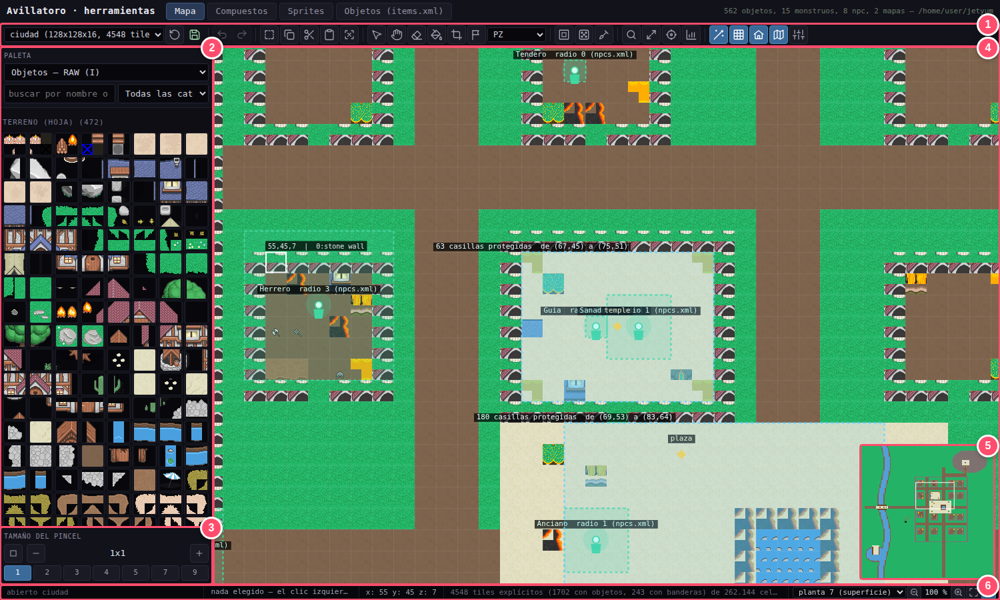
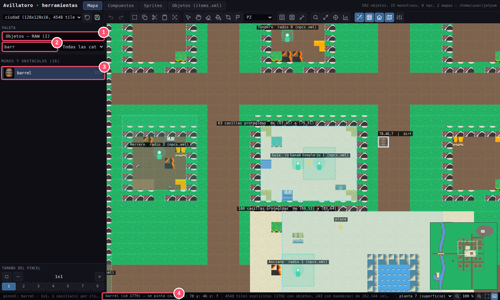
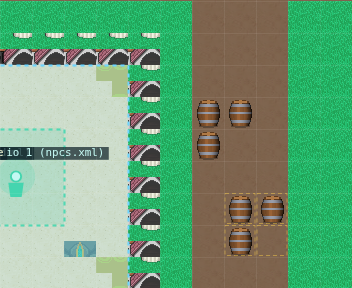
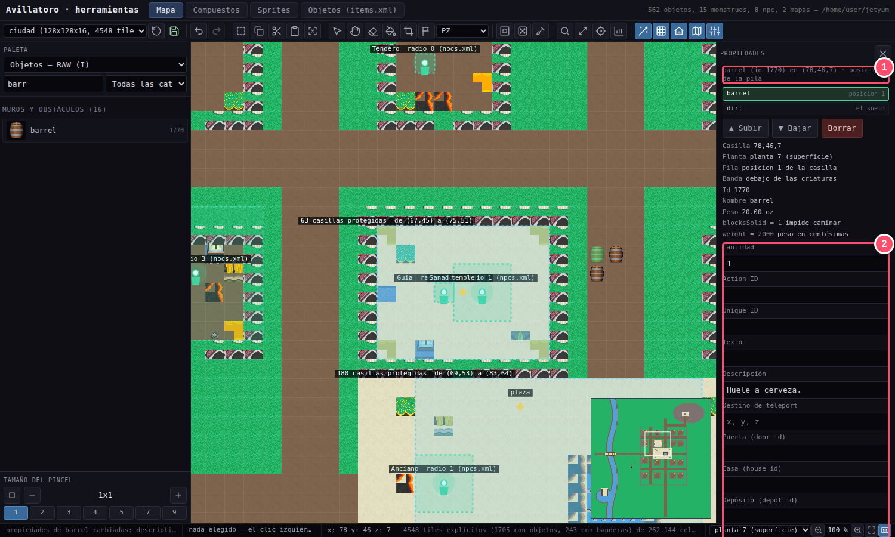
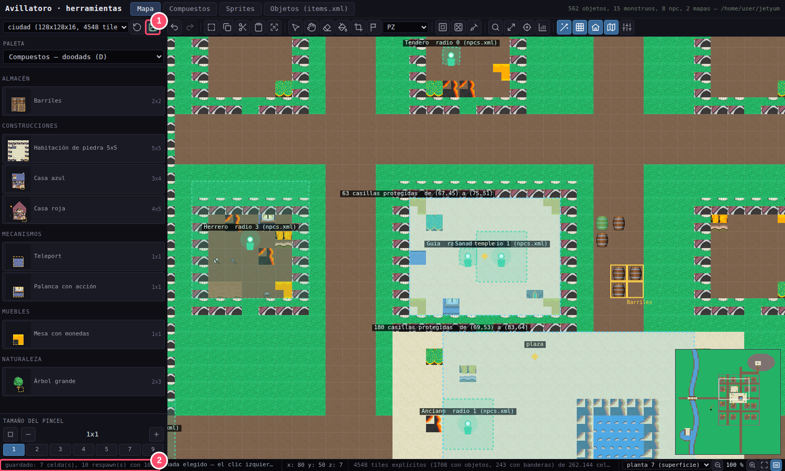
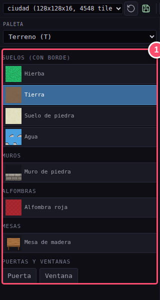
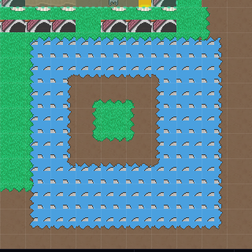

# 🗺️ Guía 3 · Colocar: la pestaña Mapa

> **Lo que vas a conseguir:** poner tu objeto en el mundo, darle detalles propios y conocer las
> herramientas del mapa.
> **Tiempo:** unos 10 minutos · **Necesitas:** el objeto dado de alta (guías 1 y 2).

[← Anterior: Dar de alta](02-objetos.md) · [Índice](README.md) · [Siguiente: Agrupar →](04-compuestos.md)

---

## Un vistazo a la pestaña

La pestaña **Mapa** es donde se construye el mundo. Funciona como el editor de mapas de Tibia
(Remere's Map Editor): eliges algo en la paleta y lo pintas sobre el mapa.

| | Zona | Para qué sirve |
|:-:|---|---|
| **1** | **Barra de iconos** | A la izquierda, el mapa que editas, **Recargar** y **Guardar**. Después: deshacer, seleccionar, copiar y pegar, borrar, rellenar, capturar, banderas, buscar, ir a una posición… **Deja el ratón quieto encima de un icono** y te dice qué hace y su atajo. |
| **2** | **La paleta** | Arriba, un desplegable elige **qué paleta** ves: Terreno, Objetos, Compuestos, Casas, Ciudades, Waypoints o Criaturas y NPC. Debajo, todo lo que puedes poner en el mapa. |
| **3** | **Tamaño del pincel** | Cuántas casillas pintas de una vez, y si en cuadrado o en círculo. |
| **4** | **El mapa** | Donde pintas. Cuando eliges algo del mapa, se abre a su derecha el panel de **Propiedades**. |
| **5** | **Minimapa** | El mundo entero en pequeño. Pincha en él para ir a ese sitio. |
| **6** | **Barra de estado** | El último mensaje, lo que llevas «en la mano», la casilla bajo el ratón (x, y, z), los recuentos del mapa y, a la derecha, la **planta** (el piso) y el **zoom**. |

### Moverse por el mapa

| Para… | Haz… |
|---|---|
| Acercar o alejar | Rueda del ratón |
| Desplazarte | **Flechas** del teclado (con **Mayús**, de 10 en 10), o arrastra con el **botón central**, con **Espacio + botón izquierdo** o con Alt + botón derecho |
| Cambiar de planta | **Ctrl + rueda** o RePág / AvPág |
| Ver el mapa entero | Tecla **0** |
| Ir a unas coordenadas | **Ctrl+G** |

---

## Paso 1 · Elegir el objeto en la paleta

En el desplegable de la paleta elige **«Objetos — RAW»** y escribe parte del nombre en el buscador.

1. El desplegable de la paleta, en **«Objetos — RAW»**.
2. Escribe en el buscador: **«barr»**. Al lado, otro desplegable deja ver una sola **categoría**
   (suelos, muros, decoración…), como el «Tileset» de Remere's.
3. Pincha el **barril**. Queda resaltado.
4. En la barra de estado, abajo, el editor te confirma lo que llevas y cómo se va a pintar.

Al mover el ratón por el mapa verás el barril transparente: es un **fantasma** que te enseña
dónde caerá.

> [!TIP]
> **¿Tu objeto no aparece en la paleta?** Comprueba que lo creaste en la pestaña Objetos (guía 2)
> y pulsa **Recargar** (la flecha circular, arriba a la izquierda).

---

## Paso 2 · Pintar

**Pincha en el mapa** y el barril quedará en esa casilla. Los gestos básicos:

| Gesto | Qué hace |
|---|---|
| **Clic** | Pone el objeto. Si la casilla ya tenía objetos, los **sustituye**. |
| **Mayús + clic** | Lo **añade encima** de lo que haya (una moneda sobre una mesa). |
| **Arrastrar** | Pinta seguido, casilla a casilla. |
| **Clic derecho** | Borra. |
| **Escape** | Suelta lo que llevas en la mano. |
| **Ctrl+Z** / **Ctrl+Y** | Deshacer / rehacer. |

> [!NOTE]
> El **pincel**, debajo de la paleta, decide cuántas casillas pintas de una vez: de 1×1 a 19×19
> (con los botones o con las teclas **[** y **]**), en cuadrado o en círculo (el primer icono).

---

## Paso 3 · Darle detalles propios a un objeto

Cada objeto colocado puede tener sus **propiedades particulares**: un texto, una descripción,
un número de acción para los scripts, el destino de un teletransporte… Es el diálogo
«Propiedades» de Remere's.

Con la mano vacía (pulsa **Escape**), **pincha el barril** que quieres retocar. A la derecha del
mapa se abre el panel de **Propiedades**; se cierra con su **X** y se vuelve a abrir con el último
icono de la barra.

1. **El objeto de la casilla:** qué es, su número, su peso, sus reglas y en qué posición está
   dentro de su casilla. Los botones **Subir** y **Bajar** cambian el orden si hay varios
   objetos en la misma casilla.
2. **Las propiedades:** en el ejemplo, la **Descripción** «Huele a cerveza.». Pulsa
   **«Aplicar propiedades»**.

| Propiedad | Para qué sirve |
|---|---|
| **Cantidad** | Cuántos hay (para monedas y otras cosas apilables). |
| **Action ID** | Para que un script haga algo con **este** objeto en concreto, por ejemplo que esta palanca abra aquella puerta. |
| **Unique ID** | Un número único en todo el mundo (cofres de misión). |
| **Texto** | Lo que está escrito (cartas, carteles). |
| **Descripción** | Lo que se añade al mirarlo. |
| **Destino de teleport** | A dónde lleva al pisarlo. |

---

## Paso 4 · Guardar

1. Pulsa **Guardar** (el disquete verde, arriba a la izquierda).
2. En la barra de abajo verás cuántas casillas se han guardado. Mientras haya cambios
   pendientes, esa barra lo indica con **«N sin guardar»**.

> [!IMPORTANT]
> El editor **comprueba el mapa antes de escribirlo**. Si algo no cuadra (un objeto que no existe,
> algo fuera del mapa), no guarda y te explica por qué. El archivo anterior queda intacto.

---

## Más herramientas del mapa

### 🌱 Terreno con bordes automáticos

En la paleta **Terreno** tienes pinceles «inteligentes»:

- **Suelos.** Al pintar tierra junto a la hierba, el borde de hierba se pone solo.
- **Muros.** Al dibujar una habitación, el muro elige solo la pieza de cada casilla: recta,
  esquina o poste.
- **Puertas y ventanas.** Se ponen pinchando encima de un muro.
- **Alfombras y mesas.** Encajan sus piezas solas.

<table>
<tr>
<td></td>
<td></td>
</tr>
<tr>
<td align="center"><em>La paleta Terreno</em></td>
<td align="center"><em>Agua, una isla de tierra y un parche de hierba: los bordes se han puesto solos</em></td>
</tr>
</table>

### 🧰 La barra de edición

Todos son iconos: deja el ratón encima de cualquiera para ver su nombre y su atajo.

| Botón | Atajo | Qué hace |
|---|:-:|---|
| **Seleccionar** | S | Marca un rectángulo arrastrando. |
| **Copiar / Cortar / Pegar** | Ctrl+C / X / V | Para duplicar o mover zonas enteras. |
| **Borrar sel.** | Supr | Vacía la zona seleccionada. |
| **Rellenar** | Ctrl+D | El «cubo de pintura»: rellena de un suelo toda la zona conectada. |
| **Borderizar** | Ctrl+B | Repasa los bordes y muros de la selección (o de lo que ves). |
| **Buscar** | Ctrl+F | Encuentra un objeto por número, por Action ID o por el texto escrito. |
| **Reemplazar** | Ctrl+Shift+F | Cambia un objeto por otro en todo el mapa o en la selección. |
| **Ir a…** | Ctrl+G | Salta a unas coordenadas. |
| **Estadísticas** | F8 | Cuántas cosas hay en el mapa y cuáles son las más usadas. |
| **Borde auto** | A | Activa o desactiva los bordes automáticos. |
| **Minimapa** | M | Lo muestra u oculta. |

### 🏠 Casas, ciudades y waypoints

En el desplegable de la paleta, **Casas**, **Ciudades** y **Waypoints**:

- **Casas.** Crea una casa con **«+ Casa»**, pinta su interior con **«Casillas»** y marca la
  puerta de fuera con **«Salida»**. Cada casa se ve de un color.
- **Ciudades.** Cada ciudad tiene su **templo**, el sitio donde se reaparece.
- **Waypoints.** Puntos con nombre del mapa, como «templo» o «puerto».

### 👾 Monstruos y NPC

En el desplegable de la paleta, **«Criaturas y NPC»**:

- **Respawn** crea una zona donde aparecen monstruos.
- **Monstruo** añade más monstruos a esa zona.
- **NPC** coloca un personaje.
- **Elegir** (el icono de la flecha, en la barra) sirve para moverlos y retocarlos.

---

[← Anterior: Dar de alta](02-objetos.md) · [Índice](README.md) · [Siguiente: Agrupar →](04-compuestos.md)
