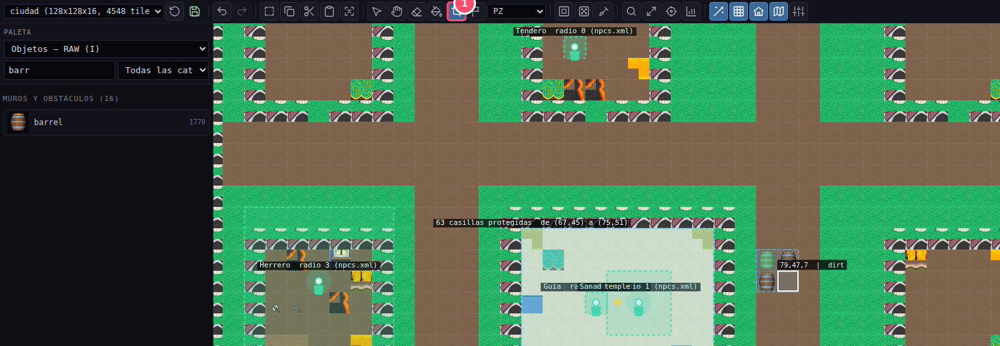
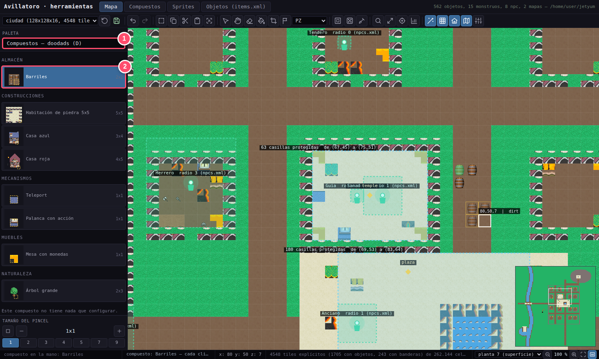
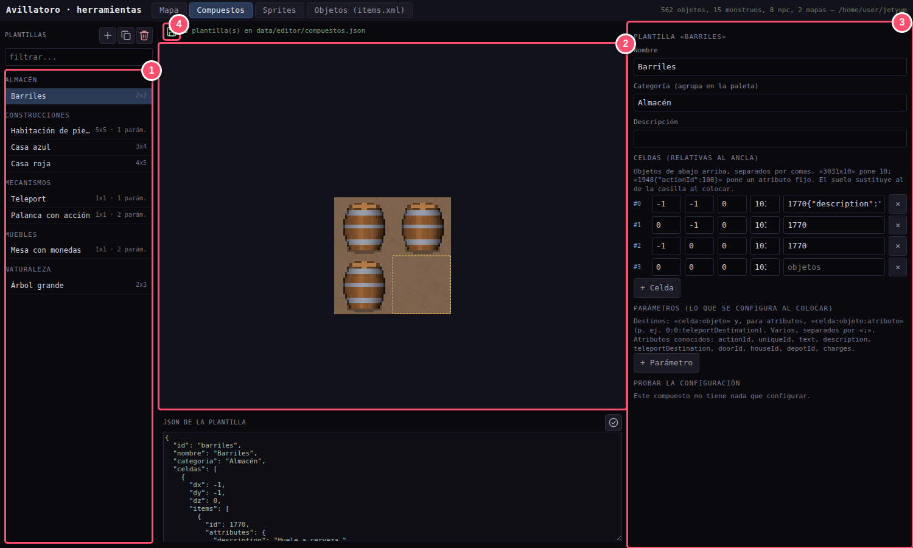

# 🧩 Guía 4 · Agrupar: los objetos compuestos

> **Lo que vas a conseguir:** guardar varios objetos como uno solo (una casa, un almacén, un
> teletransporte ya configurado) y colocarlos de un clic.
> **Tiempo:** unos 5 minutos · **Necesitas:** algo colocado en el mapa (guía 3).

[← Anterior: Colocar](03-mapa.md) · [Índice](README.md) · [Siguiente: Jugar →](05-juego.md)

---

## ¿Qué es un compuesto?

Imagina que has montado un rincón con **tres barriles** y lo quieres repetir por todo el
mundo. Podrías pintar los tres barriles cada vez… o guardarlos **como una sola pieza** y ponerla
de un clic. Eso es un **compuesto** (en Remere's se llaman *doodads*).

Un compuesto:

- **Se coloca entero**, con todas sus partes en su sitio.
- **Se elige entero.** Pinchas cualquiera de sus casillas y se marca todo con un contorno
  amarillo.
- **Se mueve, se reconfigura o se borra entero.**
- **Puede tener ajustes** que eliges al ponerlo. Por ejemplo, el destino de un teletransporte o
  el número de monedas de una mesa.

> [!NOTE]
> El juego solo ve los objetos sueltos, igual que en Tibia. El compuesto es una comodidad del
> editor para construir más rápido.

---

## Paso 1 · Capturar un compuesto del mapa

La forma más rápida de crear un compuesto es **copiarlo de algo que ya hayas construido**.

1. En la barra de iconos, pulsa **Capturar** (el icono de recortar).
2. Pincha **una esquina** de lo que quieres guardar y luego **la esquina opuesta**. Verás un
   recuadro azul.
3. Escribe un **nombre** (en el ejemplo, «Barriles») y una **categoría** (en el ejemplo,
   «Almacén»).

El compuesto queda guardado y listo para usar.

---

## Paso 2 · Colocarlo

En el desplegable de la paleta, elige **«Compuestos — doodads»**.

1. El desplegable de la paleta, en **Compuestos**.
2. Elige **«Barriles»** (está en la categoría «Almacén»). Al mover el ratón verás el grupo
   entero, transparente, donde caería.

**Pincha en el mapa** y aparecerá entero. Cada clic pone uno más.

### Retocar uno ya colocado

Con la mano vacía (**Escape**), pincha cualquier casilla del compuesto. En **«El objeto
compuesto»**, en el panel de **Propiedades** que se abre a la derecha, tienes:

| Botón | Qué hace |
|---|---|
| **Aplicar** | Cambia sus ajustes (si los tiene). |
| **Mover** | El siguiente clic en el mapa lo lleva entero a esa casilla. |
| **Descomponer** | Lo deja como objetos sueltos, que ya no se mueven juntos. |
| **Borrar entero** | Quita todas sus partes del mapa. |

---

## Paso 3 · Afinar la plantilla

La pestaña **Compuestos** (arriba) es donde se guardan y editan todas las plantillas.

| | Zona | Para qué sirve |
|:-:|---|---|
| **1** | **Plantillas** | Todas, agrupadas por categoría. |
| **2** | **Vista previa** | Cómo es la plantilla. El recuadro discontinuo es el **ancla**, la casilla que pinchas al colocarla. |
| **3** | **Propiedades** | El nombre, la categoría, las **celdas** (qué objetos hay en cada sitio) y los **parámetros**. |
| **4** | **Guardar compuestos** | El disquete verde: escribe los cambios. Se ilumina cuando hay cambios sin guardar. |

### Ajustes al colocar (parámetros)

Un **parámetro** es una pregunta que el editor te hace al poner el compuesto. Los que vienen de
ejemplo:

| Compuesto | Te pregunta… |
|---|---|
| **Teleport** | ¿A dónde lleva? (x, y, planta) |
| **Palanca con acción** | ¿Qué Action ID tiene, para que un script la reconozca? |
| **Mesa con monedas** | ¿Cuántas monedas? ¿De oro o de cristal? |
| **Habitación de piedra** | ¿Qué Action ID tiene la palanca de dentro? |

Para añadir uno, pulsa **«+ Parámetro»**, dale un nombre y di a qué objeto afecta. Por ejemplo,
`0:0:actionId` significa «el primer objeto de la primera celda, en su Action ID». La sección
**«Probar la configuración»** te enseña el formulario tal y como lo verás al colocarlo.

> [!TIP]
> Puedes **escribir las celdas a mano**: `113, 3031x10` pone una mesa con 10 monedas encima.

---

[← Anterior: Colocar](03-mapa.md) · [Índice](README.md) · [Siguiente: Jugar →](05-juego.md)
