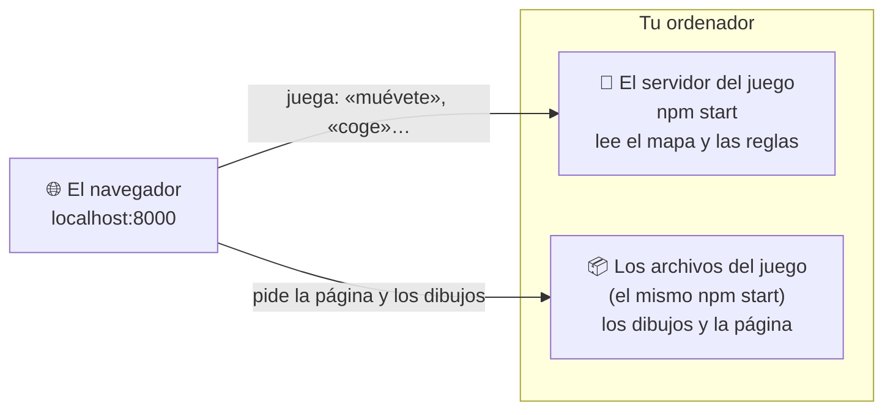
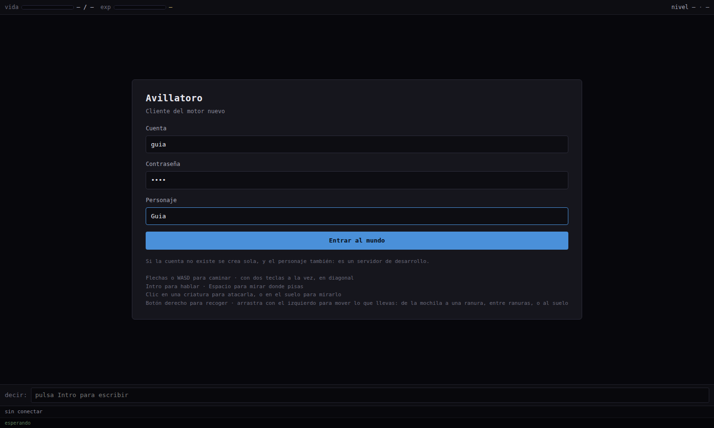
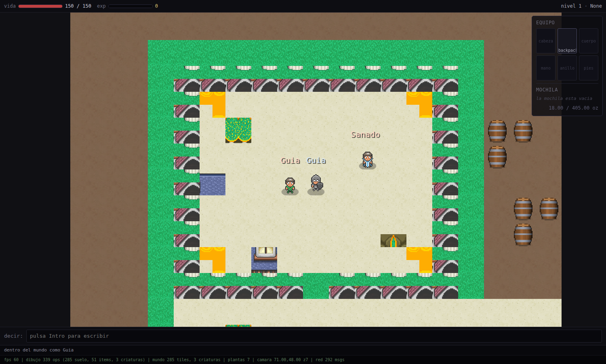
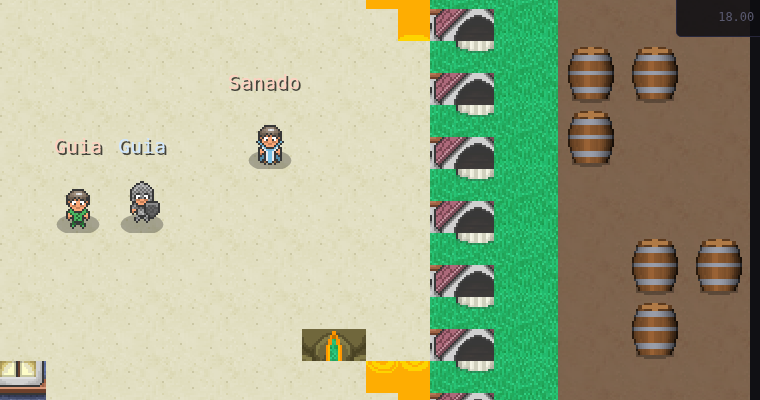
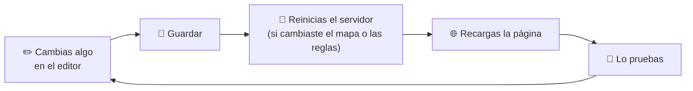

# 🎮 Guía 5 · Jugar: ver tus cambios en el juego

> **Lo que vas a conseguir:** arrancar el juego con tu mapa y encontrarte tu barril en el mundo.
> **Tiempo:** unos 3 minutos · **Necesitas:** el mapa guardado (guía 3).

[← Anterior: Agrupar](04-compuestos.md) · [Índice](README.md)

---

## Cómo funciona

El juego tiene **dos partes**, y cada una se arranca en su propia ventana de terminal:



- **El servidor** es el árbitro. Al arrancar lee el mapa y las fichas de los objetos, y decide
  qué se puede hacer.
- **Los archivos** son la página del juego y los dibujos que descarga cada jugador.

> [!IMPORTANT]
> **El servidor lee el mapa al arrancar.** Si guardas cambios con el servidor encendido, apágalo
> y vuelve a arrancarlo para verlos. Los **dibujos** no lo necesitan: basta con recargar la
> página del navegador.

---

## Paso 1 · Arrancar el servidor con tu mapa

Abre una terminal en la carpeta del proyecto y escribe:

```bash
npm start
```

Arranca las dos partes a la vez: el servidor del juego y los archivos (la página y los dibujos).
Lo hace con el mapa de `config.js`, que es **`jetyum`**. Para jugar en otro mapa de los que
hay en el editor, añade su nombre: `npm start -- --map sample` (el mapa de la aldea, con el arte
HD: `npm run serve:aldea`).

Si todo va bien, verás que carga el mapa (*«mapa: jetyum 112x96x16…»*) y se queda esperando
jugadores.

> [!TIP]
> **¿Quieres que otro mapa sea siempre el del juego?** Abre `config.js` y cambia la línea
> `mapName: 'jetyum'` por el nombre de tu mapa. Así basta con `npm start`.

## Paso 2 · Entrar

Abre en el navegador **http://localhost:8000/jetyum/**.



La primera vez, ve a la pestaña **«Crear cuenta»**: cuenta (de 3 a 20 letras o números),
contraseña (dos veces, al menos 4 caracteres), el nombre del personaje, su **vocación** (Sorcerer,
Druid, Paladin, Knight o ninguna) y su **sexo**, y pulsa **«Crear y entrar»**. La vocación sólo se
elige aquí: decide su vida, su maná, lo que carga y lo rápido que sube cada skill, y el sexo, qué
ropa puede llevar. Todo sale de `data/XML/vocations.js` y `outfits.js`
([VOCACIONES.md](../VOCACIONES.md)). Si la cuenta ya existe (con su contraseña), se le añade el
personaje.

Las siguientes veces, en **«Entrar»**: escribe la cuenta y la contraseña (el **ojo** del campo la
enseña) y pulsa **«Entrar»**. Aparece la **lista de tus personajes**, con su nivel y su vocación:
elige uno y pulsa **«Entrar al mundo»** (o doble clic, o las flechas e Intro). La flecha de arriba
vuelve para cambiar de cuenta, y al salir del mundo vuelves a la lista.

Marca **«Recordar cuenta»** y la próxima vez la lista sale directamente, con el último personaje
elegido (se guarda sólo en ese navegador; desmárcalo y entra para olvidarla).

**Con amigos.** Cada uno entra con su cuenta desde su navegador. Desde otro equipo de tu red, usa
la dirección que escribe el servidor web al arrancar («Para jugar desde otro equipo de tu red»), y
deja pasar los puertos 8000 y 8081 en el cortafuegos. Si alguien ya está de pie en el templo,
apareces a su lado.

### La pantalla del juego

Como la de Tibia: el mapa en el centro, la **consola** abajo (pestañas *Default* y *Server Log*,
cada mensaje con su hora) y a la derecha la **barra lateral**:

- el **minimapa**, que se rellena con lo que vas viendo (**clic** en él: vas andando hasta ahí; si no se puede llegar, o es una zona sin descubrir, te acercas todo lo posible y te paras) (botones: acercar, alejar, ver otra planta
  y volver a centrar);
- la **vida** y el **maná**;
- el **equipo**: las diez ranuras, y debajo tus **almas**, tu **capacidad** libre y el botón de
  las **hotkeys** (el teclado);
- el minimapa, la vida y el equipo son **ventanas** como las demás: se arrastran por su cabecera
  (a la otra columna o flotando) y se minimizan con su botón;
- ocho botones con su explicación al pasar el ratón: *Stop*, *Quests*, *Options*, *Help*,
  *Skills*, *Battle*, *VIP* y *Logout*;
- las ventanas, que se abren ordenadas y nunca cambian de columna solas (la **columna izquierda**
  está siempre a la vista, para que el mapa no cambie de tamaño, y ahí van las que lleves tú). Si
  abres un contenedor y ya no cabe, **se cierra el último contenedor** que tenías abierto en esa
  columna; la página nunca tiene barra de desplazamiento: **Skills** (nivel, experiencia, nivel mágico y las skills con su barra), **Batalla**
  (lo que tienes a la vista; clic para atacar), **VIP**, **Opciones**, **Ayuda** y la **Mochila**
  (sólo si llevas una puesta). Los cuerpos que abres van saliendo debajo, en el orden en que los abres.
  **Cualquier ventana se arrastra por su cabecera**: suéltala cerca de una columna y se queda en
  ella, en el hueco que marca la línea azul; suéltala en cualquier otro sitio y se queda flotando
  ahí. Dónde dejas cada una se recuerda en el navegador.

## Paso 4 · Buscar tu objeto

Los personajes nuevos aparecen en el **templo**. Nuestros barriles estaban justo a su derecha:





Ahí están los tres barriles y el compuesto «Barriles». Prueba a caminar contra uno: como le
pusimos **blocksSolid**, el servidor no te deja atravesarlo.

### Controles del juego

| Tecla o gesto | Acción |
|---|---|
| Flechas | Caminar (dos teclas a la vez para ir en diagonal), también mientras escribes |
| Escribir | El chat está **siempre abierto**: lo que tecleas va a la línea de abajo e **Intro** lo manda |
| **Ctrl+K** (o el botón del teclado junto a la capacidad) | Las **hotkeys**: a cada tecla F1–F12 y Shift+F1–F12 le das una **magia** (se dice al pulsarla, o se escribe en el chat) o un **objeto** de los que llevas, **en ti** o **en tu objetivo** (una poción para otro jugador). Se guardan por personaje |
| `/wasd` | Cambia al modo WASD: caminas también con W, A, S y D, y para escribir hay que pulsar Intro antes. Otra vez `/wasd` lo quita |
| Espacio | Mirar la casilla donde estás (en modo `/wasd`) |
| Clic izquierdo en el mapa | Ir andando hasta esa casilla (si se puede llegar). **Deslizar** el ratón con el botón pulsado (más de unos píxeles) no es un clic: no te mueve, aunque sueltes en la misma casilla |
| Arrastrar algo | Sólo cuenta como arrastre si mueves el ratón más de unos píxeles; mientras lo llevas sale la **manita** |
| Los dos botones a la vez | Mirar: en el mapa, o sobre algo de tu mochila, tu equipo o un contenedor abierto (con su ataque, defensa, armadura, peso...) |
| Clic derecho **sobre un monstruo** | Atacarlo: sale un círculo rojo a sus pies y sigues pegando solo, al ritmo de tu vocación. Otra vez clic derecho sobre él, dejas de atacar |
| Arrastrar un objeto del mapa | A tu equipo o tu mochila (si está lejos, vas andando a por él), o a otra casilla a la vista (hasta 7) |
| Soltar algo en la ventana de un cuerpo o una mochila abierta, o encima de ella en el mapa | Dentro de ese contenedor (si está a tu lado y tiene huecos) |
| Soltar algo en la ranura de tu mochila | Dentro de tu mochila |
| Clic derecho en monedas | Se cambian: 100 de oro (una pila llena) → 1 de platino; 100 de platino → 1 de cristal; 1 de platino → 100 de oro; 1 de cristal → 100 de platino. Para pagar cuentan todas, y el cambio te lo dan |
| Soltar algo apilable sobre una pila igual (monedas…) | Se juntan, hasta 100 por pila: lo que sobra forma otra pila, que ocupa su propio hueco (en el suelo, en la munición, en la mochila y en los cuerpos) |
| Arrastrar la barra de encima de la consola | Hacerla más alta o más baja (el mapa nunca baja de su tamaño real) |
| Escape o botón *Stop* | Dejar de atacar |
| (al pelear o curarte) | Sobre la criatura sube el número: el daño en rojo («-29») y la curación en verde («+10») |
| Clic derecho **sobre un contenedor** (un cuerpo, una mochila en el suelo, el depósito, o tu mochila en su ranura) | Lo abre, y si ya estaba abierto lo cierra. Para coger lo de dentro, **arrástralo** a tu mochila, a tu equipo o al mapa |
| Clic derecho **sobre algo de dentro** de un contenedor | **Usarlo** (beber, comer...) |
| Clic derecho | **Usar**: abrir o cerrar una puerta, tirar de una palanca, subir una escalera de mano. Si está lejos, tu personaje **va andando** hasta allí. El clic derecho **nunca recoge**: para coger algo, arrástralo |
| Arrastrar tu mochila al suelo | Se tira **con todo lo que lleva dentro**; arrástrala otra vez a su ranura y vuelve con todo |
| Clic derecho **sobre tu personaje** | Abre tu ficha: cambiar de aspecto, colores y añadidos, y ver tu nivel, vocación, vida y capacidad |
| **E** mirando hacia algo | También **usa** (en modo `/wasd`) |
| Clic derecho (o doble clic) **sobre algo de tu mochila o tu equipo** | **Usarlo**: beber una poción (vida o maná), comer (da regeneración un rato) |
| Decir **«comerciar»** junto a un NPC con tienda (el Tendero, el Herrero) | Abre la **ventana de comercio**: pestañas Comprar y Vender, la cantidad y el total |
| Botón **Misiones** | El diario: tus misiones y cuánto te falta (empieza con «La plaga de ratas») |
| Escribir **«@Nombre texto»** | Mensaje privado: se abre una pestaña con esa persona; con ella delante, lo que escribes va a ella |
| Escribir **«/p texto»** | Mensaje a tu grupo (o usa la pestaña «Grupo») |
| Cofre de depósito (junto al templo) | Clic derecho: tu **depósito**, 30 huecos que sólo ves tú y se guardan contigo |
| Arco + flechas en la ranura de munición | Atacas **a distancia** (6 casillas): se ve la flecha y se gasta una por disparo |
| (de noche) | El mapa se oscurece: una **antorcha** puesta o `utevo lux` te dan luz |
| (en PvP) | Pegar a un jugador sin calavera te pone la **calavera blanca** 15 min; matar a 3 en un día, la **roja** |
| Pisar una escalera o un agujero | Cambia de planta: la torre de la plaza tiene un piso alto, y bajo la Casa de Piedra y el bosque hay una bodega y una cueva |

Y en el chat:

| Comando | Qué hace |
|---|---|
| `/ir` | Lista los sitios del mapa (templo, plaza, parque, bosque…) |
| `/item <id>` | Crea ese objeto a tus pies (para probar) |
| `/vocacion` / `/vocacion Knight` | Tu vocación y sus números / cambiarte de vocación (para probar) |
| `/ir parque` | Te lleva a ese sitio, para explorar rápido (prueba `/ir torre`, `/ir cueva` o `/ir bodega`) |
| `/raid goblins` | Lanza la invasión goblin sin esperar a que salga sola |
| `exura`, `exura gran`, `exura vita` | Hechizos de curación (gastan maná y suben tu nivel mágico; 1 s entre uno y otro) |
| `exori flam`, `exori vis`, `exori frigo`, `exori tera` | Golpe de fuego, energía, hielo o tierra a quien estás atacando (magos) |
| `exevo flam hur` | Onda de fuego hacia donde miras (hechiceros, nivel 18) |
| `exori` | Tajo a todo lo que tienes alrededor (caballeros) |
| `utani hur`, `utevo lux`, `exana pox` | Correr más, dar luz, quitarte el veneno |
| `/spells` | Un diálogo con todos los hechizos de tu vocación: palabras, nivel y maná (los que aún no puedes, marcados con ✗) |
| `/party invitar Nombre`, `/party unirse Nombre`, `/party salir` | Grupos: la experiencia de lo que matáis juntos se reparte (con un 20 % más), y lleváis un escudo junto al nombre |

---

## Cambiar los puertos

Cada parte escucha en su propio «puerto», el número que va después de `localhost:`. Si alguno
está ocupado por otro programa, se cambia aquí:

| Parte | Puerto | Dónde se cambia |
|---|:-:|---|
| 🧠 **El servidor del juego** (`npm start`) | 8081 | `enginePort` en **`config.js`** |
| 📦 **Los archivos del juego** (`npm start`) | 8000 | `webPort` en **`config.js`** |
| 🛠️ **El editor** (`npm run editor`) | 8090 | Al arrancarlo: `node editor/server.js --port 8091` |

- Después de cambiar `config.js`, **reinicia el juego** (`npm start`) y recarga la página. La
  página le pregunta al servidor qué puerto pone en `config.js`, así que no hay que tocar nada más.
- Para una prueba rápida sin tocar `config.js`: `npm start -- --port 8082 --web-port 8001` y entra
  con **http://localhost:8001/jetyum/**.
- Los `loginProtocolPort` y `gameProtocolPort` de `config.js` (7171 y 7172) son los de Tibia y
  aquí solo están de referencia: **no cambian nada**.

---

## Si algo no sale como esperabas

| Lo que ves | Por qué pasa | Cómo arreglarlo |
|---|---|---|
| El objeto sale con un **dibujo provisional** (un rectángulo de color) | Al juego le falta su dibujo, o el número del dibujo y el del objeto no coinciden. | En **Sprites**, comprueba que el objeto tiene ese número y pulsa **Guardar**. Después recarga la página. |
| **Puedo atravesar** el objeto | El servidor no sabe que es un obstáculo. | En **Objetos**, marca `blocksSolid`. Después reinicia el servidor. |
| **No aparece** en el mapa | El mapa no se guardó, o el servidor arrancó con otro mapa. | **Guardar** en el editor y arranca con `--map` y el nombre correcto. |
| Los cambios **no se ven** | El servidor seguía encendido con la versión anterior. | Apágalo con **Ctrl+C** y vuelve a arrancarlo. Recarga la página. |
| **«No se pudo conectar»** | El juego no está en marcha. | Comprueba que la terminal de `npm start` sigue abierta y sin errores. |

---

## 🎉 ¡Listo!

Has recorrido el camino completo de un objeto: **dibujarlo** (Sprites), **darle reglas**
(Objetos), **colocarlo** (Mapa), **agruparlo** (Compuestos) y **verlo en el juego**.

A partir de aquí, el ciclo de trabajo es siempre el mismo:



[← Anterior: Agrupar](04-compuestos.md) · [Volver al índice](README.md)

---

## Cuánto se ve del mapa

`visibleTilesX` y `visibleTilesY` en `config.js` dicen cuántas casillas se ven (ancho y alto; se
redondean a impar para que tu personaje quede en el centro). El de Tibia es 15×11; en una pantalla
ancha, 21×11 o 23×11 llena los lados en vez de dejar franjas negras. Hay que reiniciar el motor.

