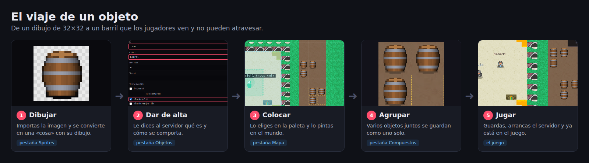
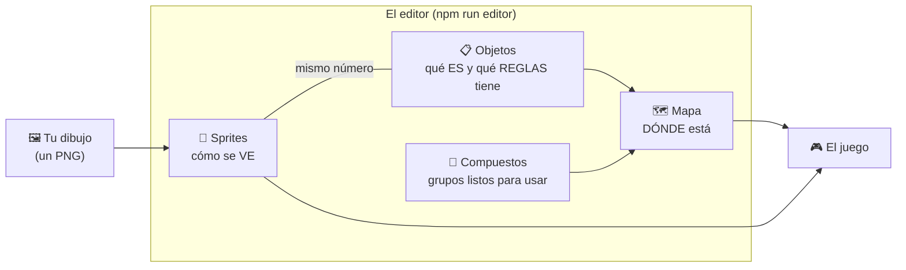
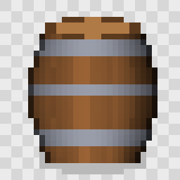

# Guías visuales de Jetyum

**Del dibujo al juego, paso a paso y sin tecnicismos.**

Estas guías te acompañan en el camino completo de un objeto del juego, desde que es un dibujo
en tu ordenador hasta que un jugador se lo encuentra en el mundo. Todas siguen el mismo ejemplo:
**un barril**. Las capturas son reales: se hicieron siguiendo estos mismos pasos.

---

## Las cinco guías

| | Guía | Lo que aprendes | Tiempo |
|:-:|---|---|:-:|
| 🎨 | [**1. Dibujar** — la pestaña Sprites](01-sprites.md) | Meter un dibujo en el juego y decir cómo es: su tamaño, si se puede pisar, si se puede coger… | 5 min |
| 📋 | [**2. Dar de alta** — la pestaña Objetos](02-objetos.md) | Contarle al servidor qué es ese objeto: su nombre, su peso y sus reglas | 3 min |
| 🗺️ | [**3. Colocar** — la pestaña Mapa](03-mapa.md) | Poner el objeto en el mundo, darle detalles y usar las herramientas del mapa | 10 min |
| 🧩 | [**4. Agrupar** — los objetos compuestos](04-compuestos.md) | Guardar varios objetos juntos (una casa, un almacén) para ponerlos de un clic | 5 min |
| 🎮 | [**5. Jugar** — ver tus cambios en el juego](05-juego.md) | Arrancar el juego y comprobar que todo está donde lo dejaste | 3 min |

Puedes leerlas por orden, la primera vez, o ir directamente a la que necesites.

---

## Cómo encajan las piezas

Un objeto del juego tiene **tres partes**, y cada una vive en un sitio distinto. Es lo mismo que
pasa en Tibia:

- **Cómo se ve** es cosa del **dibujo** (pestaña Sprites). Lo usa el navegador del jugador para
  pintar la pantalla.
- **Qué es y qué reglas tiene** es cosa del **servidor** (pestaña Objetos). Por ejemplo, si se
  puede atravesar o cuánto pesa. El servidor es el árbitro: aunque alguien trucara su pantalla,
  seguiría sin poder atravesar un barril.
- **Dónde está** es cosa del **mapa** (pestaña Mapa).

> [!IMPORTANT]
> **El número es el pegamento.** El dibujo y las reglas se reconocen porque llevan el **mismo
> número** (en el ejemplo, el **1770**). Si los números no coinciden, el juego no sabrá qué
> dibujo va con qué reglas.

---

## Antes de empezar

Solo hace falta hacerlo una vez:

1. Ten instalado **Node.js** (versión 20.19 o superior).
2. Abre una terminal en la carpeta del proyecto y escribe `npm install`.
3. Para abrir el editor, escribe `npm run editor` y entra en **http://localhost:8090** con
   tu navegador.

Si quieres seguir el ejemplo, la imagen del barril está en
[`ejemplo/barril.png`](ejemplo/barril.png):

---

## Pequeño diccionario

| Palabra | Qué quiere decir |
|---|---|
| **Sprite** | Un cuadradito de dibujo de 32×32 píxeles. Es la pieza más pequeña de la que están hechos todos los gráficos. |
| **Cosa** | Un dibujo completo y listo para usar, hecho de uno o varios sprites. Un barril es una cosa de un sprite; un árbol grande puede ser una cosa de seis. |
| **Objeto** | Lo que existe en el juego: el barril con su nombre, su peso y sus reglas. |
| **Casilla** | Cada cuadro del mapa. Un objeto pequeño ocupa una casilla. |
| **Compuesto** | Un grupo de objetos que se coloca de una vez, como una casa entera. |
| **Planta** | Cada piso del mundo. La 7 es la superficie; las de número mayor van bajo tierra. |
| **Guardar** | Nada se escribe hasta que pulsas *Guardar*. Puedes probar sin miedo y deshacer con **Ctrl+Z**. |

---

¿Buscas la documentación técnica (formatos, algoritmos, API)? Está en
[`docs/`](../): [SPRITES.md](../SPRITES.md), [MAPAS.md](../MAPAS.md),
[HERRAMIENTAS.md](../HERRAMIENTAS.md) y [CLIENTE.md](../CLIENTE.md).
